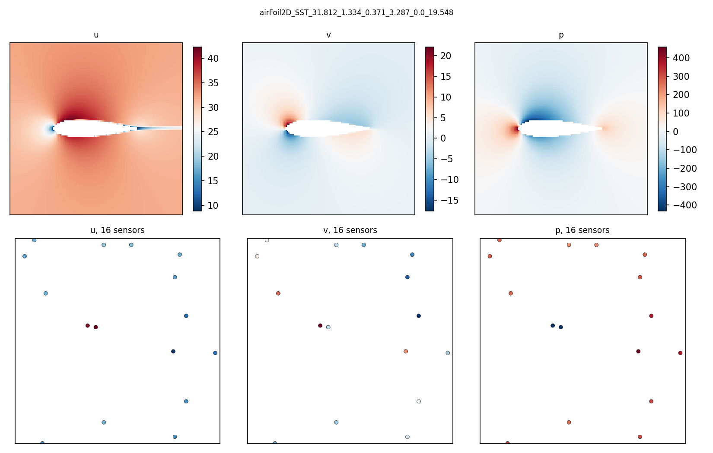

# sparse-field-reconstruction

Reconstructing 2D RANS flow fields around airfoils from a small number of point sensors,
and measuring how the error grows as sensors are removed.



Top row: a full AirfRANS case. Bottom row: the 16 sensor readings a method is given at the
0.1% setting. The gap between those two rows is the problem.

## Status

One method of four. Voronoi is the floor that the others have to beat; gappy POD and a
learned decoder land next, solver-based data assimilation in early September.

## Result

Relative L2 error, median over 200 test cases, interquartile range in brackets. Mean over
`u`, `v`, `p`.

| sensors | fraction | voronoi |
|---|---|---|
| 792 | 5% | 0.139 [0.115, 0.167] |
| 238 | 1.5% | 0.217 [0.181, 0.256] |
| 16 | 0.1% | 0.496 [0.420, 0.571] |

Cutting sensors by 50x, from 792 to 16, costs a factor 3.6 in error. Reconstruction takes
under 0.05 s per case at every fraction.

## Where it loses

At 16 sensors the median error is 0.496, so half of every field is unrecovered, and the
IQR spans 0.420 to 0.571 — the spread across cases is a third of the error itself. A single
sensor landing near the suction peak or not is worth more than the method.

Nearest-sensor distance is Euclidean in grid space and ignores the airfoil, so a point below
the trailing edge can be assigned a sensor from the suction side, across the body. A
geodesic distance would fix it and would stop this being the trivial baseline.

## Data

[AirfRANS](https://airfrans.readthedocs.io), `scarce` task, 200 test cases. Each case is a
different unstructured mesh, so every case is interpolated once onto a shared 128x128 grid
over `x in [-0.5, 1.5]`, `y in [-1.0, 1.0]`, leaving 15,847 valid points and 537 masked by
the airfoil. The mesh sits on the plane z=0.5; the grid follows it.

The common grid costs near-wall resolution, which is where the error concentrates.
Reconstruction on the native unstructured mesh is separate work and is not done here.

## Metric

Relative L2 error per field, `||pred - true|| / ||true||`, evaluated only on non-sensor,
non-masked points, so no method is credited for returning values it was given. Median and
IQR across cases rather than mean and standard deviation: a few hard cases dominate the
mean and hide the typical behaviour.

## Sensor placement

Uniform random over valid grid points, one permutation per case, prefixes taken for each
fraction. The 0.1% set is a subset of the 1.5% set is a subset of the 5% set, so differences
between fractions are sensor count and not placement luck. Sensor locations are identical
across methods for a given case and fraction. Seed is fixed per case from the case name.

## Reproducing

```
pip install -e .
python -c "import airfrans as af; af.dataset.download(root='data/raw', unzip=True, OpenFOAM=False)"
python scripts/build_cache.py --split test
python scripts/build_cache.py --split train
python -m src.run --methods voronoi
python scripts/plot_error.py
```

Download is 9 GB and took 35 minutes. Cache build is 0.11 s per case.

## Licence

MIT.
